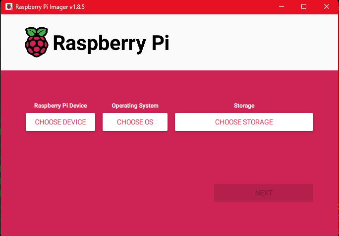
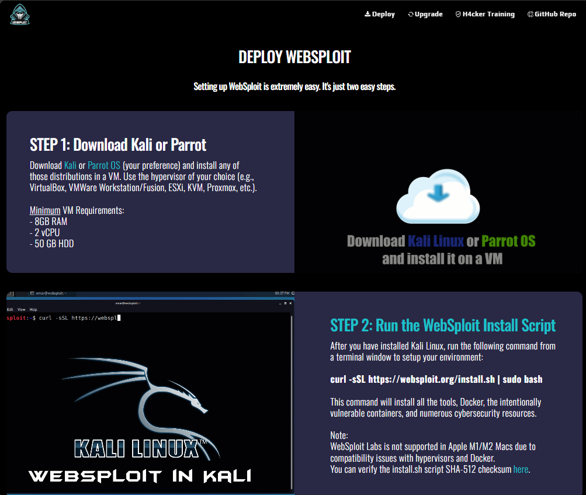
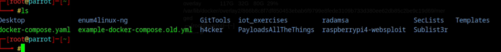
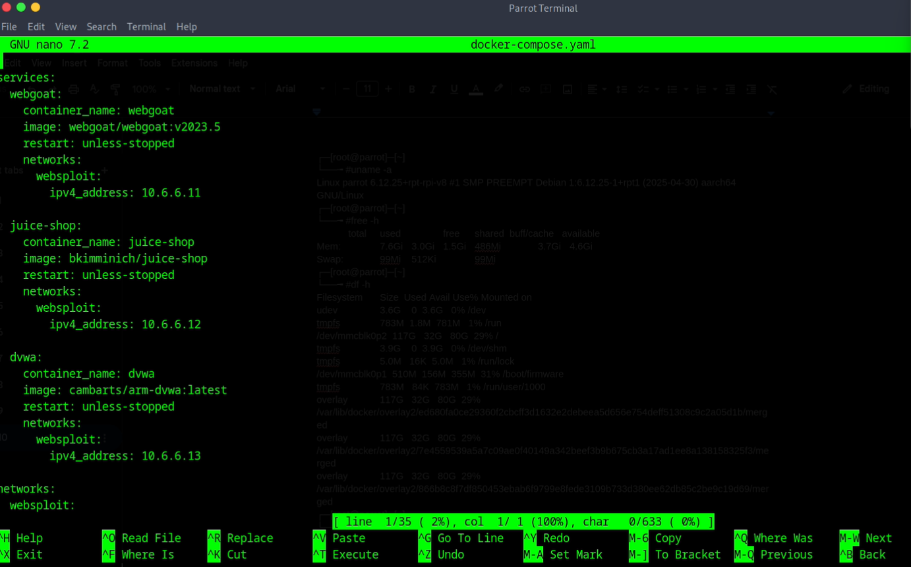
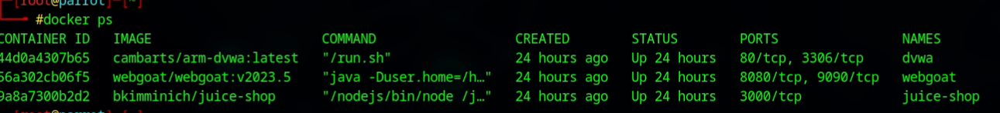
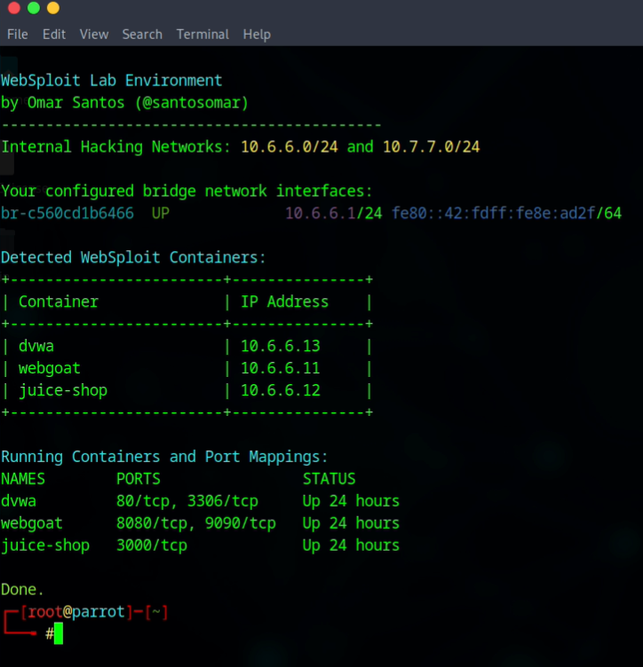

# RaspberryPi4-WebSploit
A penetration testing environment deployed on Raspberry Pi 4 running Parrot OS, using Dockerized vulnerable apps and standard recon tools (Nmap, Nikto, OWASP ZAP, and more).

## Lab Enviroment Overview
This lab is designed to simulate a realistic penetration testing workflow using ARM-compatible infrastructure, containerized vulnerable apps, and open-source tools — all hosted on a Raspberry Pi 4 running Parrot OS.

### Why a Raspberry Pi 4?
The Raspberry Pi 4 Model B was chosen because:
- Low cost & low power: Ideal for building self-contained, always-on testing environments.
- ARM architecture: Mimics the limitations of IoT and embedded systems — common real-world targets.
- 8GB RAM model: Provides enough resources to run multiple Docker containers and tools simultaneously.
- Portability: Easy to deploy anywhere and useful for air-gapped, secure testing environments.
### Why Parrot OS?
Parrot Security OS was chosen for the following reasons:
- Security-focused distro: Preinstalled with ethical hacking and digital forensics tools.
- Lightweight on ARM: Performs better than heavier distros like Kali on a Pi.
- Debian-based: Easy to update, manage, and compatible with most pentesting tools.
- Active support for ARM: Parrot officially supports Raspberry Pi installations.
### Why Docker?
All vulnerable apps (WebGoat, DVWA, Juice Shop) are containerized because:
- Isolation: Each app runs in its own networked container.
- Reproducibility: Labs can be rebuilt with a single command ```docker compose up -d```.
- Customization: Easy to assign static IPs, expose specific ports, and simulate real networks.
- Performance: Docker’s lightweight containers run efficiently on ARM.
### Why Use WebSploit?
WebSploit Labs is an educational platform developed by Omar Santos to facilitate hands-on learning in cybersecurity domains such as ethical hacking, bug hunting, incident response, digital forensics, and threat hunting.
- Key features of WebSploit Labs include:
  - Deployment of intentionally vulnerable applications (e.g., WebGoat, DVWA, Juice Shop) within Docker containers.
  - Compatibility with security-focused operating systems like Kali Linux and Parrot Security OS.
  - Inclusion of over 9,000 cybersecurity resources and more than 500 distinct exercises.
#### WebSploit Labs has been widely adopted by educational institutions worldwide and is utilized in various training sessions, including those at DEF CON.
### About Omar Santos
Omar Santos is a distinguished figure in the cybersecurity community, renowned for his contributions to ethical hacking, vulnerability research, incident response, and AI security. He serves as a Distinguished Engineer at Cisco, focusing on product security and incident response.
- Beyond his role at Cisco, Omar is deeply involved in various industry initiatives:
  - Lead of the DEF CON Red Team Village, where he organizes hands-on workshops and challenges. 
  - Chair of the Common Security Advisory Framework (CSAF) Technical Committee under OASIS Open.
  - Co-chair of the Forum of Incident Response and Security Teams (FIRST) PSIRT Special Interest Group (SIG).
#### Omar is also a prolific author, having written over 25 books and 21 video courses covering topics like ethical hacking, penetration testing, and AI security.

# Lab Setup:
---
<details>
<summary>Equipment:</summary>

- **Model**:  
  - Raspberry Pi 4 Model B  
- **Operating System**:  
  - Linux parrot 6.12.25+rpt-rpi-v8 #1 SMP PREEMPT Debian 1:6.12.25-1+rpt1 (2025-04-30) aarch64 GNU/Linux  
- **Memory**:  
  - 8GB  
- **Storage**:  
  - 128GB  
- **Infographic**:
  - 
  - cmdline:
```bash
┌─[root@parrot]─[~]
└──╼ #uname -a
Linux parrot 6.12.25+rpt-rpi-v8 #1 SMP PREEMPT Debian 1:6.12.25-1+rpt1 (2025-04-30) aarch64 GNU/Linux
┌─[root@parrot]─[~]
└──╼ #free -h
           	total    	used    	free  	shared  buff/cache   available
Mem:       	7.6Gi   	3.0Gi   	1.5Gi   	486Mi   	3.7Gi   	4.6Gi
Swap:       	99Mi   	512Ki    	99Mi
┌─[root@parrot]─[~]
└──╼ #df -h
Filesystem  	Size  Used Avail Use% Mounted on
udev        	3.6G 	0  3.6G   0% /dev
tmpfs       	783M  1.8M  781M   1% /run
/dev/mmcblk0p2  117G   32G   80G  29% /
tmpfs       	3.9G 	0  3.9G   0% /dev/shm
tmpfs       	5.0M   16K  5.0M   1% /run/lock
/dev/mmcblk0p1  510M  156M  355M  31% /boot/firmware
tmpfs       	783M   84K  783M   1% /run/user/1000
overlay     	117G   32G   80G  29% /var/lib/docker/overlay2/ed680fa0ce29360f2cbcff3d1632e2debeea5d656e754deff51308c9c2a05d1b/merged
overlay     	117G   32G   80G  29% /var/lib/docker/overlay2/7e4559539a5a7c09ae0f40149a342beef3b9b675cb3a17ad1ee8a138158325f3/merged
overlay     	117G   32G   80G  29% /var/lib/docker/overlay2/866b8c8f7df850453ebab6f9799e8fede3109b733d380ee62db85c2be9c19d69/merged
┌─[root@parrot]─[~]
└──╼ #
```
</details>

<details>
<summary>Installation:</summary>

- **Download Operating System (Parrot or Kali)**:  
  - Download ParrotOS for RaspberryPi 4 here:
    - https://www.parrotsec.org/ 
  - Download Kali Linux for RaspberryPi 4 here:
    - n/a
- **Flash image to disk using RaspberryPi Imager**:  
  - 
  - Download RaspberryPi Imager here:
    - https://www.raspberrypi.org/ 
- **Boot Pi with Parrot or Kali OS default login's**:  
  - ParrotOS:
    - pi
    - parrot
  - Kali Linux:
    - n/a
    - n/a  
- **Download and install Websploit Labs**:  
  - Installation Script:
    - ```curl -sSL https://websploit.org/install.sh | sudo bash```
    -   
- **Updating Websploit Docker containers to support ARM arch**:  
  - From the cmdline login into root
    - ```sudo su```
  - Move to Root's root directory to find the Websploit home directory ~/h4cker
    - ```cd ~/```
  - Stay in the root directory & shutdown & remove all running conatiners
    - 1. Stop All Containers
      - ```docker stop $(docker ps -aq)```
    - 2. Remove All Containers
      - ```docker rm $(docker ps -aq)```
    - 3. (Optional) Clean Up Volumes and Networks
       - ```docker volume prune -f```
       - ```docker network prune -f```
    - 4. (Optional) Verify Clean State
      - ```docker ps -a```
  - Copy provider docker-compose file & keep as referance
    - ```cp docker-compose.yml example-docker-compose.yml```
    - 
  - Create/Edit docker-compose file that supports ARM arch
    - ```nano docker-compose.yml```
    - 
    - New docker-compose.yml file that supports ARM arch & recreates networks
      - ```docker-compose.yaml```
```yaml
services:
  webgoat:
    container_name: webgoat
    image: webgoat/webgoat:v2023.5
    restart: unless-stopped
    networks:
      websploit:
        ipv4_address: 10.6.6.11

  juice-shop:
    container_name: juice-shop
    image: bkimminich/juice-shop
    restart: unless-stopped
    networks:
      websploit:
        ipv4_address: 10.6.6.12

  dvwa:
    container_name: dvwa
    image: cambarts/arm-dvwa:latest
    restart: unless-stopped
    networks:
      websploit:
        ipv4_address: 10.6.6.13

networks:
  websploit:
    driver: bridge
    ipam:
      config:
        - subnet: 10.6.6.0/24
          gateway: 10.6.6.1

```
  - Build & start new docker containers & network
    - ```docker-compose up -d```
  - Confirm containers and network are working properly
    - ```docker ps```
    - 
  - Use Websploit built in container scanner
    - ```containers```
    - 

</details>

# Recon
### Phase 1: Network Recon (Nmap)
- What I did:
  - I began by scanning the internal RaspberryPi4-WebSploit network (10.6.6.0/24) using Nmap to identify live hosts and open TCP ports. This provided a broad view of available services and gave me three target IPs with interesting ports, including web-facing services on ports 80, 8080, 3000, and 9090.
- Why I did it:
  - To enumerate active hosts and map the attack surface
  - Identify potential web services to investigate further
  - Started with a scan using Nmap on network 10.6.6.0/24
### Phase 2: Web Recon (Nikto)
- What I did:
  - I then ran Nikto on the discovered web services to detect common vulnerabilities, misconfigurations, and hidden directories. This revealed accessible paths like /dump.tgz, /database.tgz, and /config/, as well as outdated Apache and PHP versions.
- Why I did it:
  - To find low-hanging fruit like open directories, outdated versions
  - Nikto is fast and automated, making it great for early recon
  - Scaned host indivisual with Nikto
### Phase 3: Web App Assessment (ZAP)
- What I did:
  - Based on the Nikto results, I progressed to OWASP ZAP for a more in-depth and interactive analysis of the web applications. I chose ZAP to perform both passive and active scans, observe requests in real time, and explore site structure using spidering tools.
- Why I did it:
  - Unlike Nikto, ZAP allows manual interaction, auth testing, and deeper scan customization
  - I can inspect HTTP headers, cookies, authentication flows, and inject test payloads
  - ZAP supports proxying a browser, ideal for dynamic and client-heavy web apps
# Attack

# ExFill & Reporting

# References

